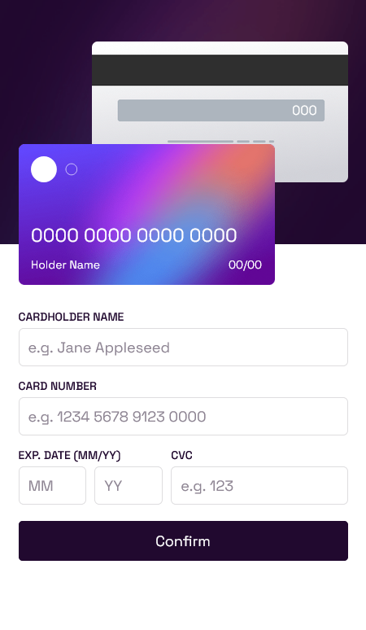
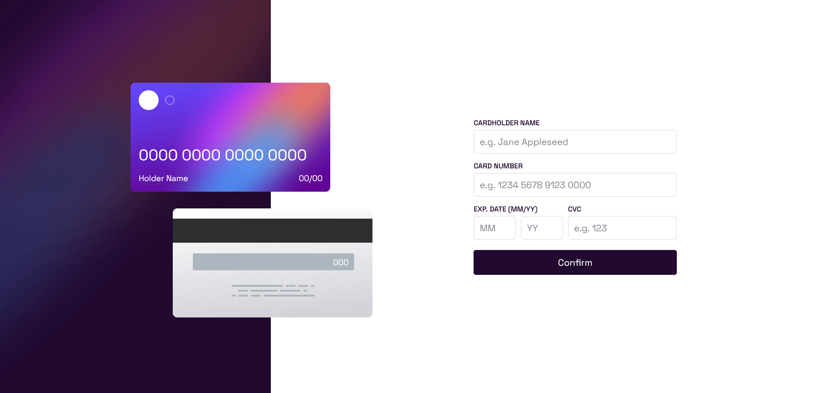

## Overview
This is my solution for front-end mentor challenge name: [Interactive card details form](https://www.frontendmentor.io/challenges/interactive-card-details-form-XpS8cKZDWw)

### Screenshot
Mobile view\

desktop view\

### Demo
[click Me]()

### Built with
- Mobile-first workflow
- Semantic HTML5 markup
- CSS custom properties
- JS and vue.js

### What I learned
i learned how to use aria-live

### further improvement
hopefully make it more accessibile

### Author 
[wajidkhan2](https://github.com/wajidkhan2)